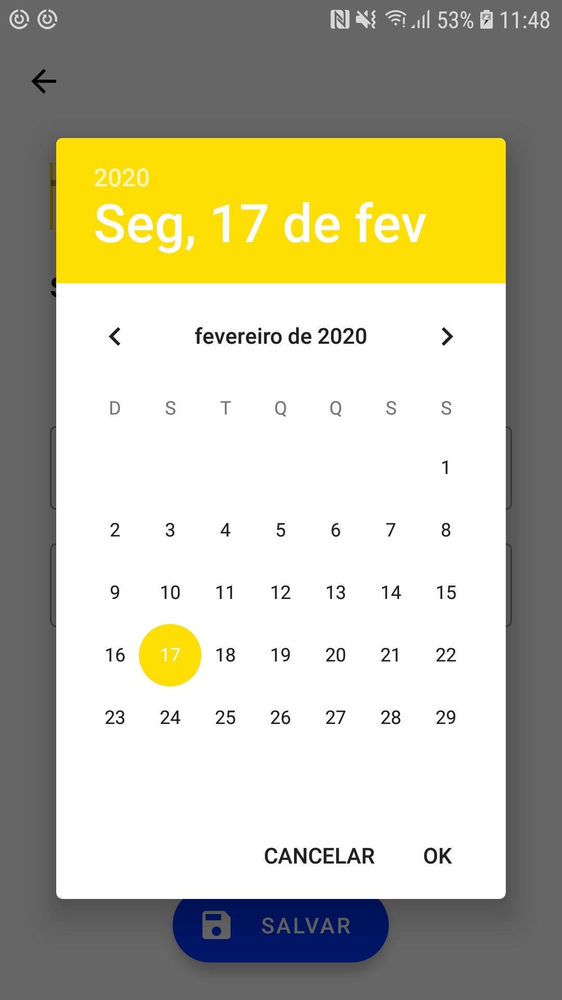
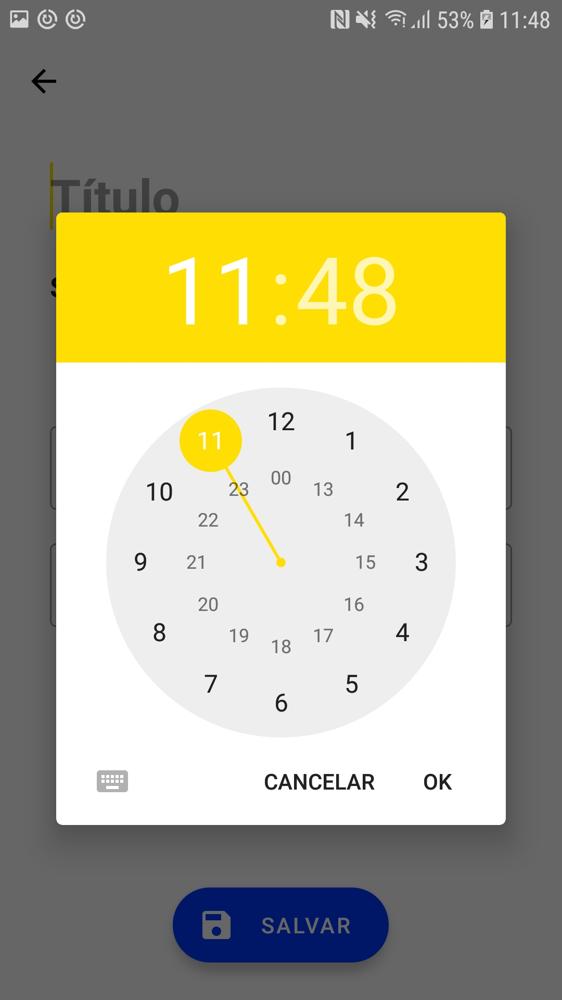

**Date And Time Picker for Android**

It's a simple lib written in **Kotlin** that init `DatePickerDialog` and when you choose your date, it automatically opens `TimePickerDialog`, and then it's unify complete date in a **callback**.

The goal was to simplify apps that need to work with date and time. 

As the application was written in kotlin, there is two extension functions to make it simpler.

**1 - Separete Date:**

```kotlin
Activity.showDateAndTimePicker { year: Int, month: Int, dayOfMonth: Int, hourOfDay: Int, minute: Int ->  
	//your code
}
 ```

**2 - Complete date String with pattern:**
```kotlin
Activity.showDateAndTimePicker("dd/MM/YYYY HH:mm") { dateFormatted ->  
	//your code
}
```






